# [📈 Live Status](https://demo.upptime.js.org): <!--live status--> **🟧 Partial outage**

This repository contains the open-source uptime monitor and status page for [targed](https://demo.upptime.js.org), powered by [Upptime](https://github.com/upptime/upptime).

With [Upptime](https://upptime.js.org), you can get your own unlimited and free uptime monitor and status page, powered entirely by a GitHub repository. We use [Issues](https://github.com/targed/uptest/issues) as incident reports, [Actions](https://github.com/targed/uptest/actions) as uptime monitors, and [Pages](https://demo.upptime.js.org) for the status page.

<!--start: status pages-->
<!-- This summary is generated by Upptime (https://github.com/upptime/upptime) -->
<!-- Do not edit this manually, your changes will be overwritten -->
<!-- prettier-ignore -->
| URL | Status | History | Response Time | Uptime |
| --- | ------ | ------- | ------------- | ------ |
|  [APIs.guru](https://apis.guru/.well-known/ai-plugin.json) | 🟩 Up | [ap-is-guru.yml](https://github.com/targed/uptest/commits/HEAD/history/ap-is-guru.yml) | 

 199ms
     
 | 

<a href="https://https://targed.github.io/uptest//history/ap-is-guru">100.00%</a>
    

|  [Appypie](https://www.appypie.com/.well-known/ai-plugin.json) | 🟩 Up | [appypie.yml](https://github.com/targed/uptest/commits/HEAD/history/appypie.yml) | 

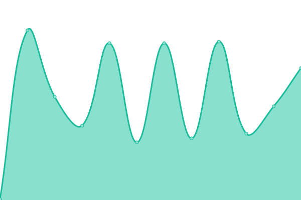 158ms
     
 | 

<a href="https://https://targed.github.io/uptest//history/appypie">100.00%</a>
    

|  [Asana](https://app.asana.com/.well-known/ai-plugin.json) | 🟩 Up | [asana.yml](https://github.com/targed/uptest/commits/HEAD/history/asana.yml) | 

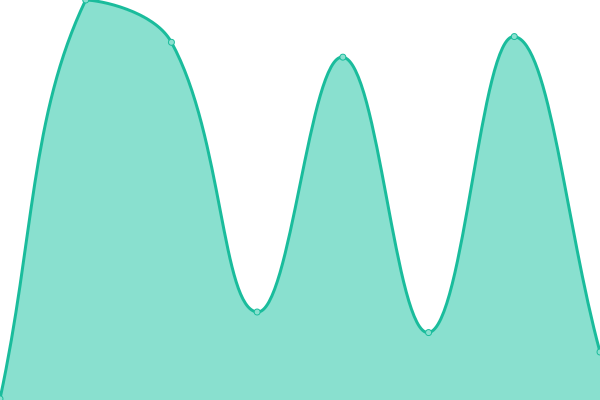 260ms
     
 | 

<a href="https://https://targed.github.io/uptest//history/asana">100.00%</a>
    

|  [ASCIIArt](https://chatgpt-plugin-ts.transitive-bullshit.workers.dev/.well-known/ai-plugin.json) | 🟩 Up | [ascii-art.yml](https://github.com/targed/uptest/commits/HEAD/history/ascii-art.yml) | 

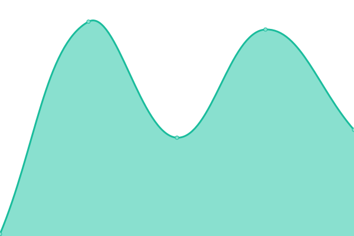 80ms
     
 | 

<a href="https://https://targed.github.io/uptest//history/ascii-art">100.00%</a>
    

|  [Babyagichatgpt](https://babyagichatgpt.skirano.repl.co/.well-known/ai-plugin.json) | 🟩 Up | [babyagichatgpt.yml](https://github.com/targed/uptest/commits/HEAD/history/babyagichatgpt.yml) | 

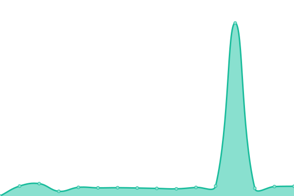 364ms
     
 | 

<a href="https://https://targed.github.io/uptest//history/babyagichatgpt">100.00%</a>
    

|  [Biztoc](https://biztoc.com/.well-known/ai-plugin.json) | 🟩 Up | [biztoc.yml](https://github.com/targed/uptest/commits/HEAD/history/biztoc.yml) | 

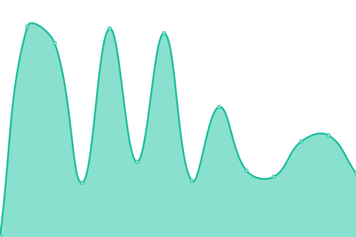 246ms
     
 | 

<a href="https://https://targed.github.io/uptest//history/biztoc">100.00%</a>
    

|  [Brainlox](https://brainlox.ai/.well-known/ai-plugin.json) | 🟩 Up | [brainlox.yml](https://github.com/targed/uptest/commits/HEAD/history/brainlox.yml) | 

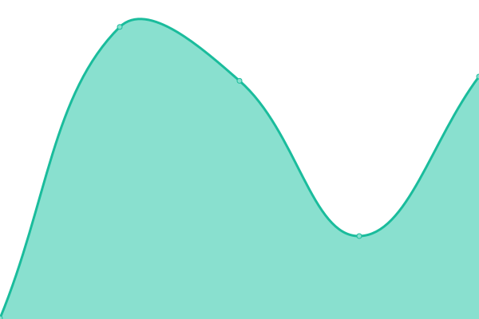 302ms
     
 | 

<a href="https://https://targed.github.io/uptest//history/brainlox">100.00%</a>
    

|  [Bundlejs](https://deno.bundlejs.com/.well-known/ai-plugin.json) | 🟩 Up | [bundlejs.yml](https://github.com/targed/uptest/commits/HEAD/history/bundlejs.yml) | 

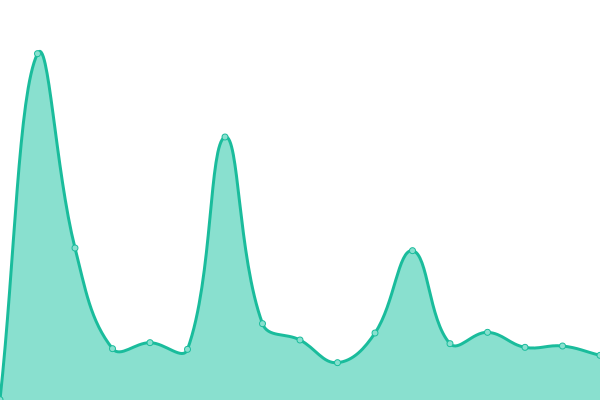 455ms
     
 | 

<a href="https://https://targed.github.io/uptest//history/bundlejs">100.00%</a>
    

|  [Calculator](https://chat-calculator-plugin.supportmirage.repl.co/.well-known/ai-plugin.json) | 🟩 Up | [calculator.yml](https://github.com/targed/uptest/commits/HEAD/history/calculator.yml) | 

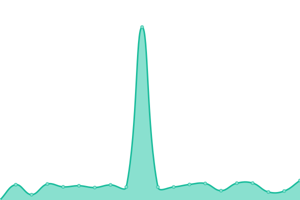 383ms
     
 | 

<a href="https://https://targed.github.io/uptest//history/calculator">100.00%</a>
    

|  [Coupert](https://www.coupert.com/.well-known/ai-plugin.json) | 🟩 Up | [coupert.yml](https://github.com/targed/uptest/commits/HEAD/history/coupert.yml) | 

 155ms
     
 | 

<a href="https://https://targed.github.io/uptest//history/coupert">100.00%</a>
    

|  [Creaticode](https://openai.creaticode.com/.well-known/ai-plugin.json) | 🟩 Up | [creaticode.yml](https://github.com/targed/uptest/commits/HEAD/history/creaticode.yml) | 

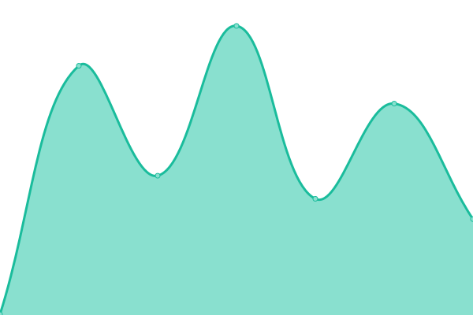 323ms
     
 | 

<a href="https://https://targed.github.io/uptest//history/creaticode">100.00%</a>
    

|  [Crossmint](https://www.crossmint.com/.well-known/ai-plugin.json) | 🟩 Up | [crossmint.yml](https://github.com/targed/uptest/commits/HEAD/history/crossmint.yml) | 

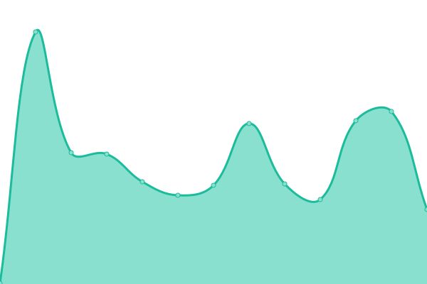 241ms
     
 | 

<a href="https://https://targed.github.io/uptest//history/crossmint">100.00%</a>
    

|  [DALL-E](https://api.openai.com/.well-known/ai-plugin.json) | 🟩 Up | [dall-e.yml](https://github.com/targed/uptest/commits/HEAD/history/dall-e.yml) | 

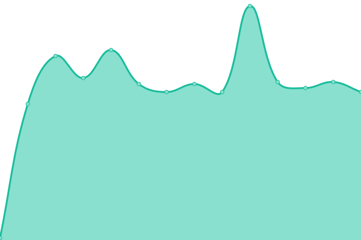 80ms
     
 | 

<a href="https://https://targed.github.io/uptest//history/dall-e">100.00%</a>
    

|  [Datamuse](https://datamuse.com/.well-known/ai-plugin.json) | 🟩 Up | [datamuse.yml](https://github.com/targed/uptest/commits/HEAD/history/datamuse.yml) | 

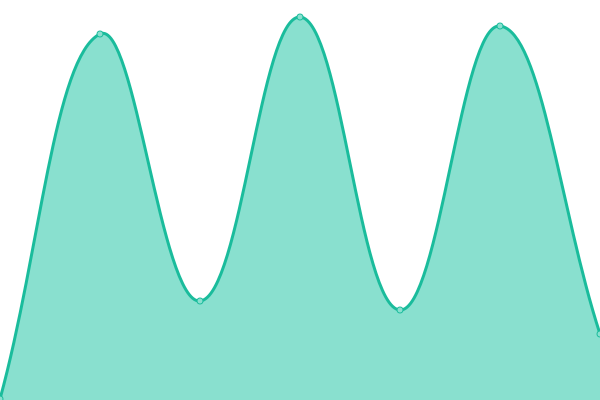 283ms
     
 | 

<a href="https://https://targed.github.io/uptest//history/datamuse">100.00%</a>
    

|  [Datasette](https://datasette.io/.well-known/ai-plugin.json) | 🟩 Up | [datasette.yml](https://github.com/targed/uptest/commits/HEAD/history/datasette.yml) | 

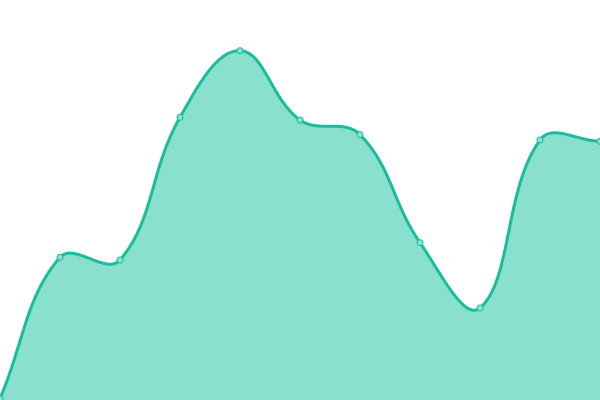 141ms
     
 | 

<a href="https://https://targed.github.io/uptest//history/datasette">100.00%</a>
    

|  [Decisionjournal](https://decisionjournalapp.com/.well-known/ai-plugin.json) | 🟩 Up | [decisionjournal.yml](https://github.com/targed/uptest/commits/HEAD/history/decisionjournal.yml) | 

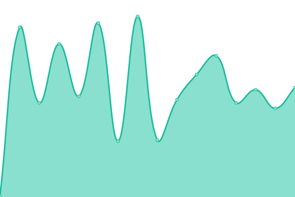 127ms
     
 | 

<a href="https://https://targed.github.io/uptest//history/decisionjournal">100.00%</a>
    

|  [Dev](https://dev.to/.well-known/ai-plugin.json) | 🟩 Up | [dev.yml](https://github.com/targed/uptest/commits/HEAD/history/dev.yml) | 

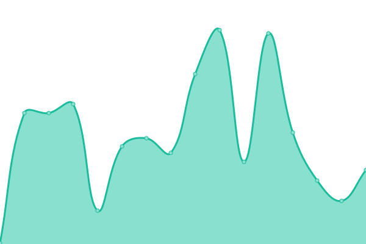 165ms
     
 | 

<a href="https://https://targed.github.io/uptest//history/dev">100.00%</a>
    

|  [Dexa Lex Fridman](https://chatgpt-plugin-dexa-lex-fridman.transitive-bullshit.workers.dev/.well-known/ai-plugin.json) | 🟩 Up | [dexa-lex-fridman.yml](https://github.com/targed/uptest/commits/HEAD/history/dexa-lex-fridman.yml) | 

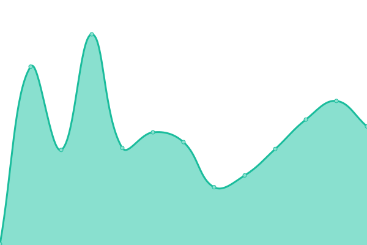 165ms
     
 | 

<a href="https://https://targed.github.io/uptest//history/dexa-lex-fridman">100.00%</a>
    

|  [Docsbot](https://docsbot.ai/.well-known/ai-plugin.json) | 🟩 Up | [docsbot.yml](https://github.com/targed/uptest/commits/HEAD/history/docsbot.yml) | 

 131ms
     
 | 

<a href="https://https://targed.github.io/uptest//history/docsbot">100.00%</a>
    

|  [Doordash](https://consumer-mobile-bff.doordash.com/v1/aichat/static/ai-plugin.json) | 🟥 Down | [doordash.yml](https://github.com/targed/uptest/commits/HEAD/history/doordash.yml) | 

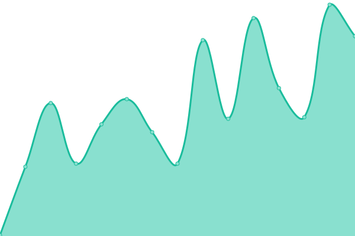 116ms
     
 | 

<a href="https://https://targed.github.io/uptest//history/doordash">0.00%</a>
    

|  [Freetv](https://www.freetv-app.com/.well-known/ai-plugin.json) | 🟩 Up | [freetv.yml](https://github.com/targed/uptest/commits/HEAD/history/freetv.yml) | 

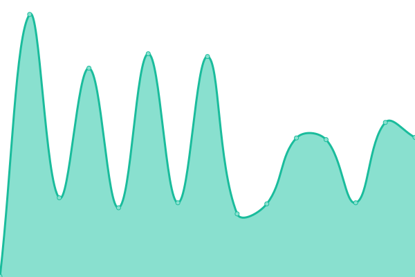 331ms
     
 | 

<a href="https://https://targed.github.io/uptest//history/freetv">100.00%</a>
    

|  [Getit](https://api.getit.ai/.well_known/ai-plugin.json) | 🟩 Up | [getit.yml](https://github.com/targed/uptest/commits/HEAD/history/getit.yml) | 

 353ms
     
 | 

<a href="https://https://targed.github.io/uptest//history/getit">100.00%</a>
    

|  [GitHub **UNOFFICIAL**](https://gh-plugin.teammait.com/.well-known/ai-plugin.json) | 🟩 Up | [git-hub-unofficial.yml](https://github.com/targed/uptest/commits/HEAD/history/git-hub-unofficial.yml) | 

 147ms
     
 | 

<a href="https://https://targed.github.io/uptest//history/git-hub-unofficial">100.00%</a>
    

|  [Gochitchat](https://gochitchat.ai/.well-known/ai-plugin.json) | 🟩 Up | [gochitchat.yml](https://github.com/targed/uptest/commits/HEAD/history/gochitchat.yml) | 

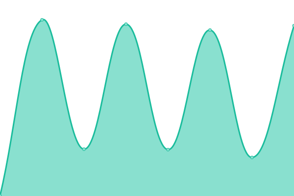 604ms
     
 | 

<a href="https://https://targed.github.io/uptest//history/gochitchat">100.00%</a>
    

|  [Gps-telecom](https://www.gps-telecom.com/.well-known/ai-plugin.json) | 🟩 Up | [gps-telecom.yml](https://github.com/targed/uptest/commits/HEAD/history/gps-telecom.yml) | 

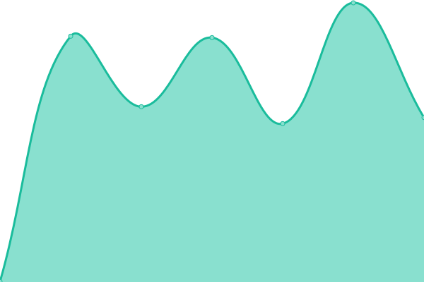 472ms
     
 | 

<a href="https://https://targed.github.io/uptest//history/gps-telecom">100.00%</a>
    

|  [Gpt.collov](https://gpt.collov.com/.well-known/ai-plugin.json) | 🟩 Up | [gpt-collov.yml](https://github.com/targed/uptest/commits/HEAD/history/gpt-collov.yml) | 

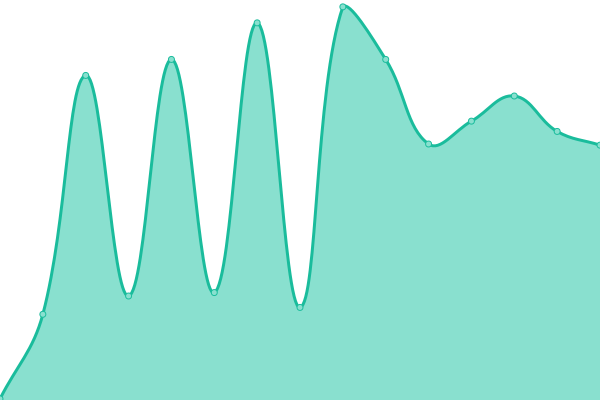 150ms
     
 | 

<a href="https://https://targed.github.io/uptest//history/gpt-collov">100.00%</a>
    

|  [GPTWeather](https://gptweather.skirano.repl.co/.well-known/ai-plugin.json) | 🟩 Up | [gpt-weather.yml](https://github.com/targed/uptest/commits/HEAD/history/gpt-weather.yml) | 

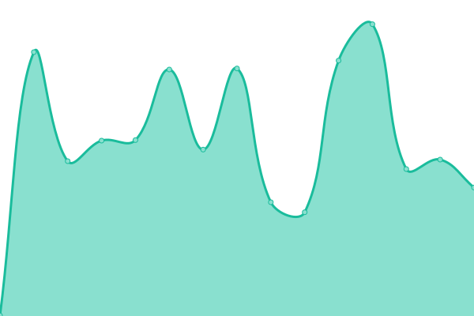 376ms
     
 | 

<a href="https://https://targed.github.io/uptest//history/gpt-weather">100.00%</a>
    

|  [Greenyroad](https://www.greenyroad.com/.well-known/ai-plugin.json) | 🟩 Up | [greenyroad.yml](https://github.com/targed/uptest/commits/HEAD/history/greenyroad.yml) | 

 87ms
     
 | 

<a href="https://https://targed.github.io/uptest//history/greenyroad">100.00%</a>
    

|  [Influence Marketing](https://influencermarketing.ai/.well-known/ai-plugin.json) | 🟩 Up | [influence-marketing.yml](https://github.com/targed/uptest/commits/HEAD/history/influence-marketing.yml) | 

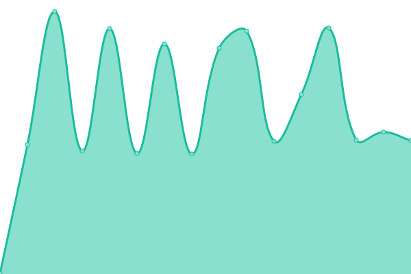 282ms
     
 | 

<a href="https://https://targed.github.io/uptest//history/influence-marketing">100.00%</a>
    

|  [Infobot](https://infobot.ai/.well-known/ai-plugin.json) | 🟥 Down | [infobot.yml](https://github.com/targed/uptest/commits/HEAD/history/infobot.yml) | 

 130ms
     
 | 

<a href="https://https://targed.github.io/uptest//history/infobot">0.00%</a>
    

|  [Iowa_State_University_Environmental_Mesonet](https://mesonet.agron.iastate.edu/.well-known/ai-plugin.json) | 🟩 Up | [iowa-state-university-environmental-mesonet.yml](https://github.com/targed/uptest/commits/HEAD/history/iowa-state-university-environmental-mesonet.yml) | 

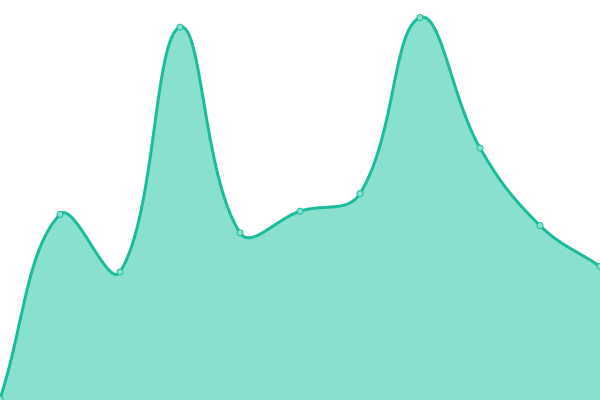 286ms
     
 | 

<a href="https://https://targed.github.io/uptest//history/iowa-state-university-environmental-mesonet">100.00%</a>
    

|  [Kalendar](https://kalendar.ai/.well-known/ai-plugin.json) | 🟩 Up | [kalendar.yml](https://github.com/targed/uptest/commits/HEAD/history/kalendar.yml) | 

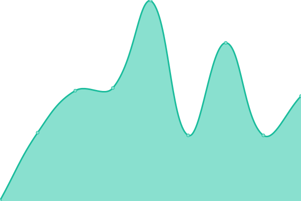 218ms
     
 | 

<a href="https://https://targed.github.io/uptest//history/kalendar">100.00%</a>
    

|  [Kittycad](https://api.kittycad.io/.well-known/ai-plugin.json) | 🟩 Up | [kittycad.yml](https://github.com/targed/uptest/commits/HEAD/history/kittycad.yml) | 

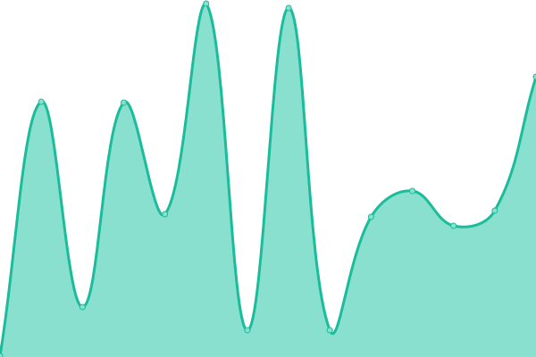 209ms
     
 | 

<a href="https://https://targed.github.io/uptest//history/kittycad">100.00%</a>
    

|  [Klarna](https://www.klarna.com/.well-known/ai-plugin.json) | 🟩 Up | [klarna.yml](https://github.com/targed/uptest/commits/HEAD/history/klarna.yml) | 

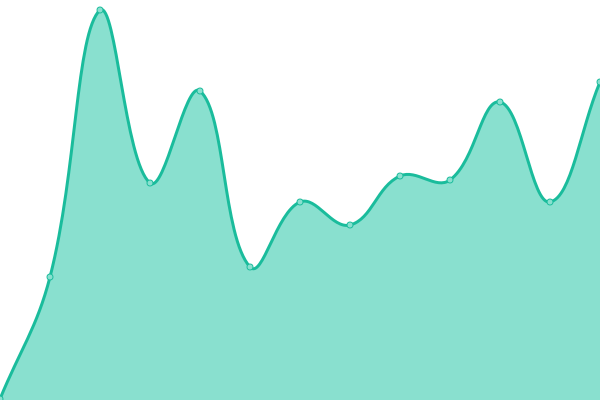 243ms
     
 | 

<a href="https://https://targed.github.io/uptest//history/klarna">100.00%</a>
    

|  [Kyuda](https://www.kyuda.io/.well-known/ai-plugin.json) | 🟩 Up | [kyuda.yml](https://github.com/targed/uptest/commits/HEAD/history/kyuda.yml) | 

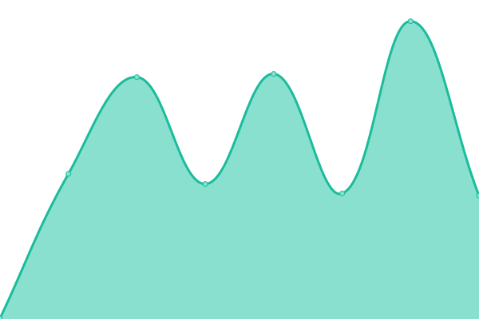 364ms
     
 | 

<a href="https://https://targed.github.io/uptest//history/kyuda">100.00%</a>
    

|  [Luma](https://lu.ma/.well-known/ai-plugin.json) | 🟩 Up | [luma.yml](https://github.com/targed/uptest/commits/HEAD/history/luma.yml) | 

 232ms
     
 | 

<a href="https://https://targed.github.io/uptest//history/luma">100.00%</a>
    

|  [Medium](https://medium.com/.well-known/ai-plugin.json) | 🟥 Down | [medium.yml](https://github.com/targed/uptest/commits/HEAD/history/medium.yml) | 

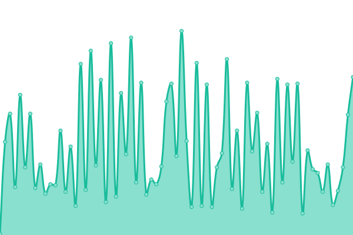 82ms
     
 | 

<a href="https://https://targed.github.io/uptest//history/medium">38.61%</a>
    

|  [Messagebird](https://www.messagebird.com/.well-known/ai-plugin.json) | 🟩 Up | [messagebird.yml](https://github.com/targed/uptest/commits/HEAD/history/messagebird.yml) | 

 583ms
     
 | 

<a href="https://https://targed.github.io/uptest//history/messagebird">100.00%</a>
    

|  [Milo](https://www.joinmilo.com/.well-known/ai-plugin.json) | 🟩 Up | [milo.yml](https://github.com/targed/uptest/commits/HEAD/history/milo.yml) | 

 178ms
     
 | 

<a href="https://https://targed.github.io/uptest//history/milo">100.00%</a>
    

|  [Mixerbox](https://www.mixerbox.com/.well-known/ai-plugin.json) | 🟩 Up | [mixerbox.yml](https://github.com/targed/uptest/commits/HEAD/history/mixerbox.yml) | 

 102ms
     
 | 

<a href="https://https://targed.github.io/uptest//history/mixerbox">100.00%</a>
    

|  [Monitup](https://www.monitup.com/.well-known/ai-plugin.json) | 🟩 Up | [monitup.yml](https://github.com/targed/uptest/commits/HEAD/history/monitup.yml) | 

 742ms
     
 | 

<a href="https://https://targed.github.io/uptest//history/monitup">100.00%</a>
    

|  [Mrkter](https://mrkter.io/.well-known/ai-plugin.json) | 🟩 Up | [mrkter.yml](https://github.com/targed/uptest/commits/HEAD/history/mrkter.yml) | 

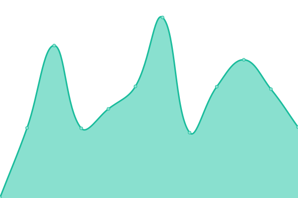 281ms
     
 | 

<a href="https://https://targed.github.io/uptest//history/mrkter">100.00%</a>
    

|  [Oneword](https://oneword.domains/.well-known/ai-plugin.json) | 🟩 Up | [oneword.yml](https://github.com/targed/uptest/commits/HEAD/history/oneword.yml) | 

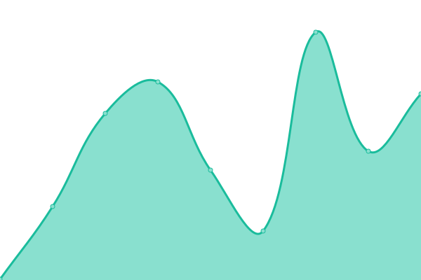 172ms
     
 | 

<a href="https://https://targed.github.io/uptest//history/oneword">100.00%</a>
    

|  [Pandia](https://pandia.pro/.well-known/ai-plugin.json) | 🟩 Up | [pandia.yml](https://github.com/targed/uptest/commits/HEAD/history/pandia.yml) | 

 191ms
     
 | 

<a href="https://https://targed.github.io/uptest//history/pandia">100.00%</a>
    

|  [Plugin.so](https://plugin.so/.well-known/ai-plugin.json) | 🟩 Up | [plugin-so.yml](https://github.com/targed/uptest/commits/HEAD/history/plugin-so.yml) | 

 211ms
     
 | 

<a href="https://https://targed.github.io/uptest//history/plugin-so">100.00%</a>
    

|  [Plugsugar](https://websearch.plugsugar.com/.well-known/ai-plugin.json) | 🟩 Up | [plugsugar.yml](https://github.com/targed/uptest/commits/HEAD/history/plugsugar.yml) | 

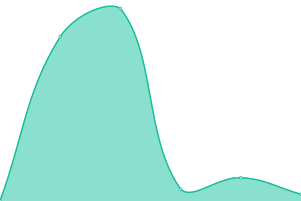 1420ms
     
 | 

<a href="https://https://targed.github.io/uptest//history/plugsugar">100.00%</a>
    

|  [Polarr](https://polarr.co/.well-known/ai-plugin.json) | 🟩 Up | [polarr.yml](https://github.com/targed/uptest/commits/HEAD/history/polarr.yml) | 

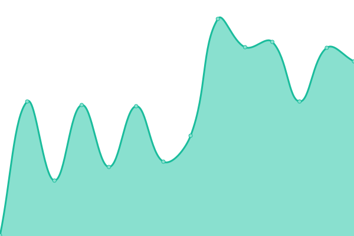 161ms
     
 | 

<a href="https://https://targed.github.io/uptest//history/polarr">100.00%</a>
    

|  [Polygon](https://polygon.io/.well-known/ai-plugin.json) | 🟩 Up | [polygon.yml](https://github.com/targed/uptest/commits/HEAD/history/polygon.yml) | 

 284ms
     
 | 

<a href="https://https://targed.github.io/uptest//history/polygon">100.00%</a>
    

|  [Portfoliopilot](https://portfoliopilot.com/.well-known/ai-plugin.json) | 🟩 Up | [portfoliopilot.yml](https://github.com/targed/uptest/commits/HEAD/history/portfoliopilot.yml) | 

 205ms
     
 | 

<a href="https://https://targed.github.io/uptest//history/portfoliopilot">100.00%</a>
    

|  [Pricerunner](https://www.pricerunner.com/.well-known/ai-plugin.json) | 🟩 Up | [pricerunner.yml](https://github.com/targed/uptest/commits/HEAD/history/pricerunner.yml) | 

 475ms
     
 | 

<a href="https://https://targed.github.io/uptest//history/pricerunner">100.00%</a>
    

|  [Quickchart](https://quickchart.io/.well-known/ai-plugin.json) | 🟩 Up | [quickchart.yml](https://github.com/targed/uptest/commits/HEAD/history/quickchart.yml) | 

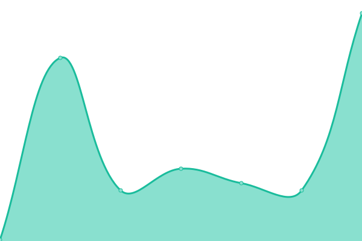 97ms
     
 | 

<a href="https://https://targed.github.io/uptest//history/quickchart">100.00%</a>
    

|  [Ramp](https://ramp.com/.well-known/ai-plugin.json) | 🟥 Down | [ramp.yml](https://github.com/targed/uptest/commits/HEAD/history/ramp.yml) | 

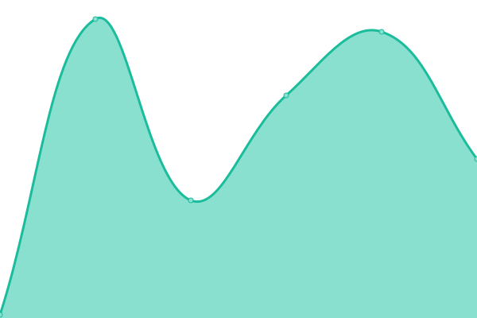 66ms
     
 | 

<a href="https://https://targed.github.io/uptest//history/ramp">0.00%</a>
    

|  [Redfin](https://www.redfin.com/.well-known/ai-plugin.json) | 🟩 Up | [redfin.yml](https://github.com/targed/uptest/commits/HEAD/history/redfin.yml) | 

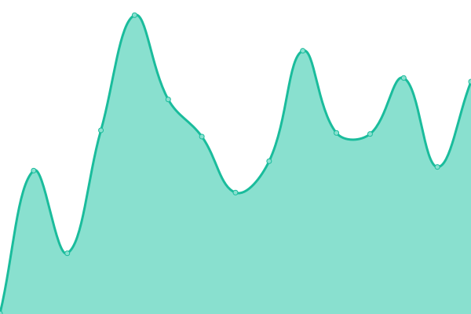 195ms
     
 | 

<a href="https://https://targed.github.io/uptest//history/redfin">100.00%</a>
    

|  [Remoteambition](https://remoteambition.com/.well-known/ai-plugin.json) | 🟩 Up | [remoteambition.yml](https://github.com/targed/uptest/commits/HEAD/history/remoteambition.yml) | 

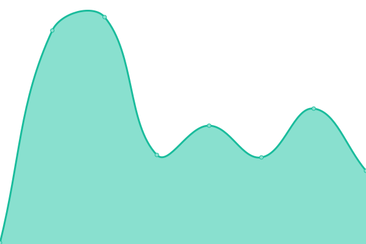 181ms
     
 | 

<a href="https://https://targed.github.io/uptest//history/remoteambition">100.00%</a>
    

|  [Rentable](https://www.rentable.co/.well-known/ai-plugin.json) | 🟩 Up | [rentable.yml](https://github.com/targed/uptest/commits/HEAD/history/rentable.yml) | 

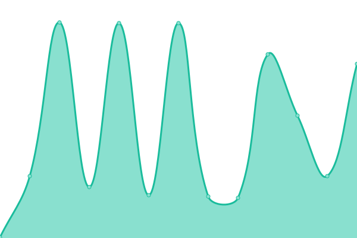 204ms
     
 | 

<a href="https://https://targed.github.io/uptest//history/rentable">100.00%</a>
    

<!--end: status pages-->

[**Visit our status website →**](https://demo.upptime.js.org)

## 📄 License

- Powered by: [Upptime](https://github.com/upptime/upptime)
- Code: [MIT](./LICENSE) © [targed](https://demo.upptime.js.org)
- Data in the `./history` directory: [Open Database License](https://opendatacommons.org/licenses/odbl/1-0/)
