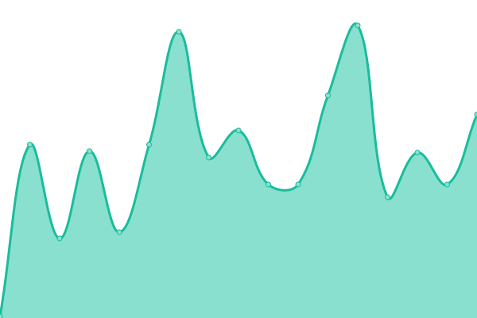
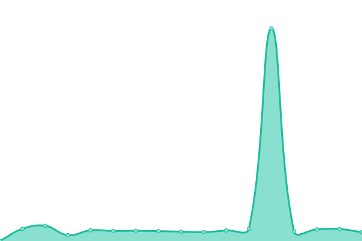
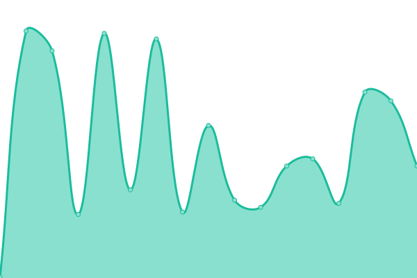

# [📈 Live Status](https://demo.upptime.js.org): <!--live status--> **🟩 All systems operational**

This repository contains the open-source uptime monitor and status page for [targed](https://demo.upptime.js.org), powered by [Upptime](https://github.com/upptime/upptime).

With [Upptime](https://upptime.js.org), you can get your own unlimited and free uptime monitor and status page, powered entirely by a GitHub repository. We use [Issues](https://github.com/targed/uptest/issues) as incident reports, [Actions](https://github.com/targed/uptest/actions) as uptime monitors, and [Pages](https://demo.upptime.js.org) for the status page.

<!--start: status pages-->
<!-- This summary is generated by Upptime (https://github.com/upptime/upptime) -->
<!-- Do not edit this manually, your changes will be overwritten -->
<!-- prettier-ignore -->
| URL | Status | History | Response Time | Uptime |
| --- | ------ | ------- | ------------- | ------ |
|  [APIs.guru](https://apis.guru/.well-known/ai-plugin.json) | 🟩 Up | [ap-is-guru.yml](https://github.com/targed/uptest/commits/HEAD/history/ap-is-guru.yml) | 

 371ms
     
 | 

<a href="https://targed.github.io/uptest/history/ap-is-guru">100.00%</a>
    

|  [Appypie](https://www.appypie.com/.well-known/ai-plugin.json) | 🟩 Up | [appypie.yml](https://github.com/targed/uptest/commits/HEAD/history/appypie.yml) | 

 212ms
     
 | 

<a href="https://targed.github.io/uptest/history/appypie">100.00%</a>
    

|  [Asana](https://app.asana.com/.well-known/ai-plugin.json) | 🟩 Up | [asana.yml](https://github.com/targed/uptest/commits/HEAD/history/asana.yml) | 

 350ms
     
 | 

<a href="https://targed.github.io/uptest/history/asana">100.00%</a>
    

|  [ASCIIArt](https://chatgpt-plugin-ts.transitive-bullshit.workers.dev/.well-known/ai-plugin.json) | 🟩 Up | [ascii-art.yml](https://github.com/targed/uptest/commits/HEAD/history/ascii-art.yml) | 

 109ms
     
 | 

<a href="https://targed.github.io/uptest/history/ascii-art">100.00%</a>
    

|  [Babyagichatgpt](https://babyagichatgpt.skirano.repl.co/.well-known/ai-plugin.json) | 🟩 Up | [babyagichatgpt.yml](https://github.com/targed/uptest/commits/HEAD/history/babyagichatgpt.yml) | 

 406ms
     
 | 

<a href="https://targed.github.io/uptest/history/babyagichatgpt">100.00%</a>
    

|  [Biztoc](https://biztoc.com/.well-known/ai-plugin.json) | 🟩 Up | [biztoc.yml](https://github.com/targed/uptest/commits/HEAD/history/biztoc.yml) | 

 311ms
     
 | 

<a href="https://targed.github.io/uptest/history/biztoc">100.00%</a>
    

|  [Brainlox](https://brainlox.ai/.well-known/ai-plugin.json) | 🟩 Up | [brainlox.yml](https://github.com/targed/uptest/commits/HEAD/history/brainlox.yml) | 

 412ms
     
 | 

<a href="https://targed.github.io/uptest/history/brainlox">100.00%</a>
    

|  [Bundlejs](https://deno.bundlejs.com/.well-known/ai-plugin.json) | 🟩 Up | [bundlejs.yml](https://github.com/targed/uptest/commits/HEAD/history/bundlejs.yml) | 

 1039ms
     
 | 

<a href="https://targed.github.io/uptest/history/bundlejs">100.00%</a>
    

|  [Calculator](https://chat-calculator-plugin.supportmirage.repl.co/.well-known/ai-plugin.json) | 🟩 Up | [calculator.yml](https://github.com/targed/uptest/commits/HEAD/history/calculator.yml) | 

 367ms
     
 | 

<a href="https://targed.github.io/uptest/history/calculator">100.00%</a>
    

<!--end: status pages-->

[**Visit our status website →**](https://demo.upptime.js.org)

## 📄 License

- Powered by: [Upptime](https://github.com/upptime/upptime)
- Code: [MIT](./LICENSE) © [targed](https://demo.upptime.js.org)
- Data in the `./history` directory: [Open Database License](https://opendatacommons.org/licenses/odbl/1-0/)
