# [📈 Live Status](https://demo.upptime.js.org): <!--live status--> **🟧 Partial outage**

This repository contains the open-source uptime monitor and status page for [targed](https://demo.upptime.js.org), powered by [Upptime](https://github.com/upptime/upptime).

With [Upptime](https://upptime.js.org), you can get your own unlimited and free uptime monitor and status page, powered entirely by a GitHub repository. We use [Issues](https://github.com/targed/uptest/issues) as incident reports, [Actions](https://github.com/targed/uptest/actions) as uptime monitors, and [Pages](https://demo.upptime.js.org) for the status page.

<!--start: status pages-->
<!-- This summary is generated by Upptime (https://github.com/upptime/upptime) -->
<!-- Do not edit this manually, your changes will be overwritten -->
<!-- prettier-ignore -->
| URL | Status | History | Response Time | Uptime |
| --- | ------ | ------- | ------------- | ------ |
|  [APIs.guru](https://apis.guru/.well-known/ai-plugin.json) | 🟩 Up | [ap-is-guru.yml](https://github.com/targed/uptest/commits/HEAD/history/ap-is-guru.yml) | 

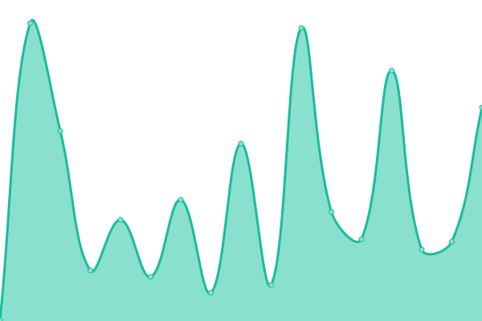 304ms
     
 | 

<a href="https://targed.github.io/uptest/history/ap-is-guru">100.00%</a>
    

|  [Appypie](https://www.appypie.com/.well-known/ai-plugin.json) | 🟩 Up | [appypie.yml](https://github.com/targed/uptest/commits/HEAD/history/appypie.yml) | 

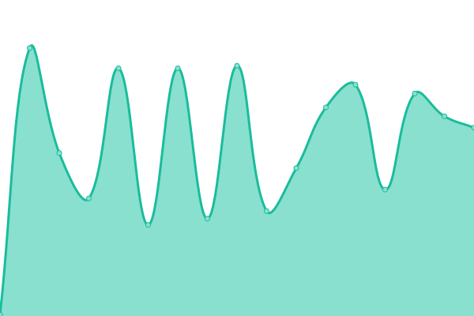 171ms
     
 | 

<a href="https://targed.github.io/uptest/history/appypie">100.00%</a>
    

|  [Asana](https://app.asana.com/.well-known/ai-plugin.json) | 🟩 Up | [asana.yml](https://github.com/targed/uptest/commits/HEAD/history/asana.yml) | 

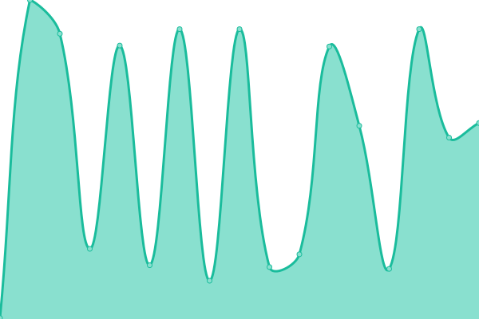 332ms
     
 | 

<a href="https://targed.github.io/uptest/history/asana">100.00%</a>
    

|  [ASCIIArt](https://chatgpt-plugin-ts.transitive-bullshit.workers.dev/.well-known/ai-plugin.json) | 🟩 Up | [ascii-art.yml](https://github.com/targed/uptest/commits/HEAD/history/ascii-art.yml) | 

 80ms
     
 | 

<a href="https://targed.github.io/uptest/history/ascii-art">100.00%</a>
    

|  [Babyagichatgpt](https://babyagichatgpt.skirano.repl.co/.well-known/ai-plugin.json) | 🟩 Up | [babyagichatgpt.yml](https://github.com/targed/uptest/commits/HEAD/history/babyagichatgpt.yml) | 

 456ms
     
 | 

<a href="https://targed.github.io/uptest/history/babyagichatgpt">100.00%</a>
    

|  [Biztoc](https://biztoc.com/.well-known/ai-plugin.json) | 🟩 Up | [biztoc.yml](https://github.com/targed/uptest/commits/HEAD/history/biztoc.yml) | 

 299ms
     
 | 

<a href="https://targed.github.io/uptest/history/biztoc">100.00%</a>
    

|  [Brainlox](https://brainlox.ai/.well-known/ai-plugin.json) | 🟩 Up | [brainlox.yml](https://github.com/targed/uptest/commits/HEAD/history/brainlox.yml) | 

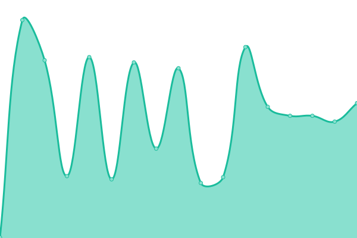 374ms
     
 | 

<a href="https://targed.github.io/uptest/history/brainlox">100.00%</a>
    

|  [Bundlejs](https://deno.bundlejs.com/.well-known/ai-plugin.json) | 🟩 Up | [bundlejs.yml](https://github.com/targed/uptest/commits/HEAD/history/bundlejs.yml) | 

 748ms
     
 | 

<a href="https://targed.github.io/uptest/history/bundlejs">100.00%</a>
    

|  [Calculator](https://chat-calculator-plugin.supportmirage.repl.co/.well-known/ai-plugin.json) | 🟩 Up | [calculator.yml](https://github.com/targed/uptest/commits/HEAD/history/calculator.yml) | 

 374ms
     
 | 

<a href="https://targed.github.io/uptest/history/calculator">100.00%</a>
    

|  [Coupert](https://www.coupert.com/.well-known/ai-plugin.json) | 🟩 Up | [coupert.yml](https://github.com/targed/uptest/commits/HEAD/history/coupert.yml) | 

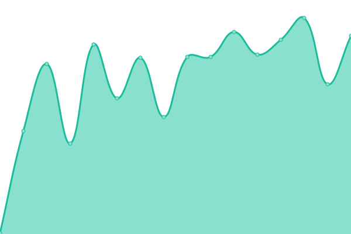 132ms
     
 | 

<a href="https://targed.github.io/uptest/history/coupert">100.00%</a>
    

|  [Creaticode](https://openai.creaticode.com/.well-known/ai-plugin.json) | 🟩 Up | [creaticode.yml](https://github.com/targed/uptest/commits/HEAD/history/creaticode.yml) | 

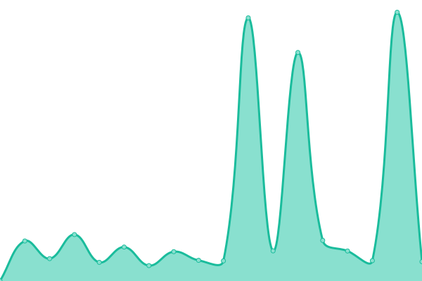 356ms
     
 | 

<a href="https://targed.github.io/uptest/history/creaticode">100.00%</a>
    

|  [Crossmint](https://www.crossmint.com/.well-known/ai-plugin.json) | 🟩 Up | [crossmint.yml](https://github.com/targed/uptest/commits/HEAD/history/crossmint.yml) | 

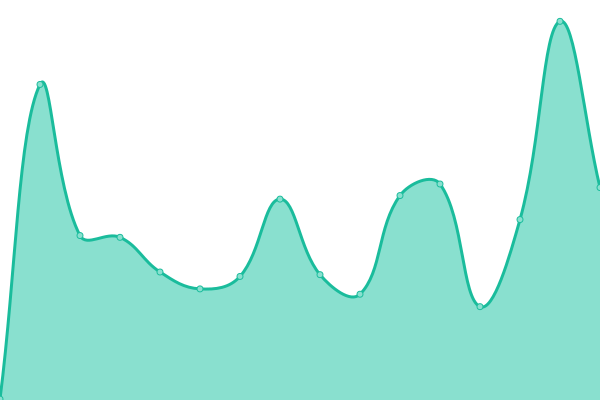 355ms
     
 | 

<a href="https://targed.github.io/uptest/history/crossmint">100.00%</a>
    

|  [DALL-E](https://api.openai.com/.well-known/ai-plugin.json) | 🟩 Up | [dall-e.yml](https://github.com/targed/uptest/commits/HEAD/history/dall-e.yml) | 

 68ms
     
 | 

<a href="https://targed.github.io/uptest/history/dall-e">100.00%</a>
    

|  [Datamuse](https://datamuse.com/.well-known/ai-plugin.json) | 🟩 Up | [datamuse.yml](https://github.com/targed/uptest/commits/HEAD/history/datamuse.yml) | 

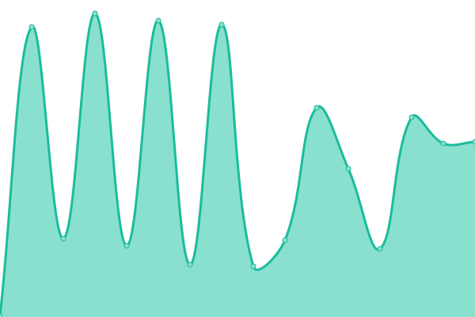 366ms
     
 | 

<a href="https://targed.github.io/uptest/history/datamuse">100.00%</a>
    

|  [Datasette](https://datasette.io/.well-known/ai-plugin.json) | 🟩 Up | [datasette.yml](https://github.com/targed/uptest/commits/HEAD/history/datasette.yml) | 

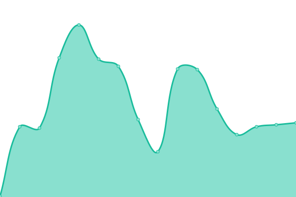 107ms
     
 | 

<a href="https://targed.github.io/uptest/history/datasette">100.00%</a>
    

|  [Decisionjournal](https://decisionjournalapp.com/.well-known/ai-plugin.json) | 🟩 Up | [decisionjournal.yml](https://github.com/targed/uptest/commits/HEAD/history/decisionjournal.yml) | 

 155ms
     
 | 

<a href="https://targed.github.io/uptest/history/decisionjournal">100.00%</a>
    

|  [Dev](https://dev.to/.well-known/ai-plugin.json) | 🟩 Up | [dev.yml](https://github.com/targed/uptest/commits/HEAD/history/dev.yml) | 

 161ms
     
 | 

<a href="https://targed.github.io/uptest/history/dev">100.00%</a>
    

|  [Dexa Lex Fridman](https://chatgpt-plugin-dexa-lex-fridman.transitive-bullshit.workers.dev/.well-known/ai-plugin.json) | 🟩 Up | [dexa-lex-fridman.yml](https://github.com/targed/uptest/commits/HEAD/history/dexa-lex-fridman.yml) | 

 182ms
     
 | 

<a href="https://targed.github.io/uptest/history/dexa-lex-fridman">100.00%</a>
    

|  [Docsbot](https://docsbot.ai/.well-known/ai-plugin.json) | 🟩 Up | [docsbot.yml](https://github.com/targed/uptest/commits/HEAD/history/docsbot.yml) | 

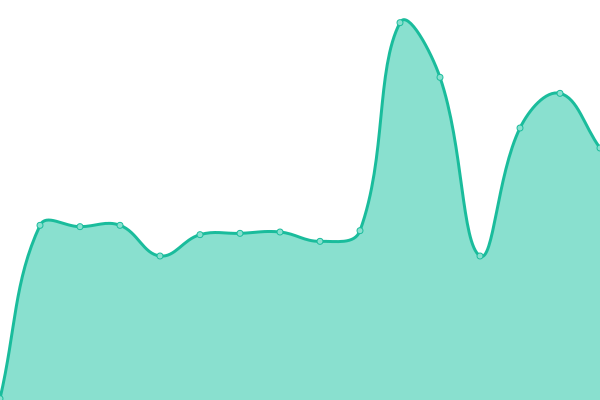 131ms
     
 | 

<a href="https://targed.github.io/uptest/history/docsbot">100.00%</a>
    

|  [Doordash](https://consumer-mobile-bff.doordash.com/v1/aichat/static/ai-plugin.json) | 🟥 Down | [doordash.yml](https://github.com/targed/uptest/commits/HEAD/history/doordash.yml) | 

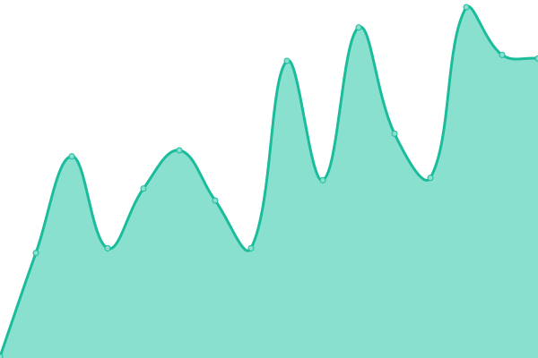 88ms
     
 | 

<a href="https://targed.github.io/uptest/history/doordash">2.18%</a>
    

|  [Freetv](https://www.freetv-app.com/.well-known/ai-plugin.json) | 🟩 Up | [freetv.yml](https://github.com/targed/uptest/commits/HEAD/history/freetv.yml) | 

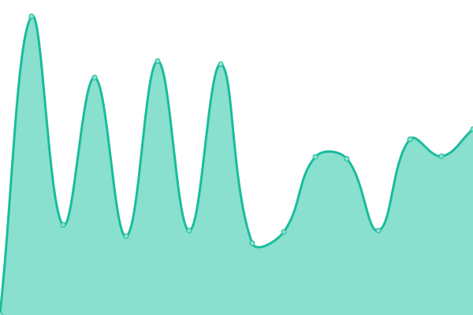 474ms
     
 | 

<a href="https://targed.github.io/uptest/history/freetv">100.00%</a>
    

|  [Getit](https://api.getit.ai/.well_known/ai-plugin.json) | 🟩 Up | [getit.yml](https://github.com/targed/uptest/commits/HEAD/history/getit.yml) | 

 324ms
     
 | 

<a href="https://targed.github.io/uptest/history/getit">100.00%</a>
    

|  [GitHub **UNOFFICIAL**](https://gh-plugin.teammait.com/.well-known/ai-plugin.json) | 🟩 Up | [git-hub-unofficial.yml](https://github.com/targed/uptest/commits/HEAD/history/git-hub-unofficial.yml) | 

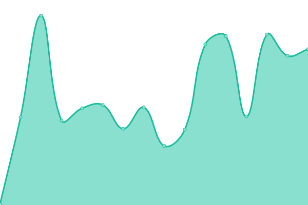 107ms
     
 | 

<a href="https://targed.github.io/uptest/history/git-hub-unofficial">100.00%</a>
    

|  [Gochitchat](https://gochitchat.ai/.well-known/ai-plugin.json) | 🟩 Up | [gochitchat.yml](https://github.com/targed/uptest/commits/HEAD/history/gochitchat.yml) | 

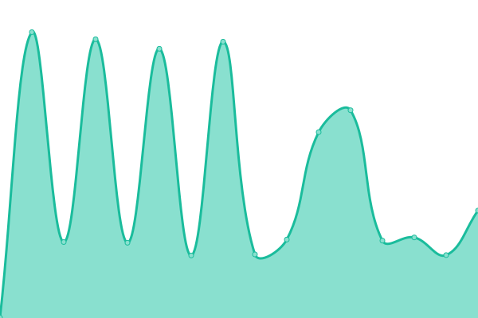 809ms
     
 | 

<a href="https://targed.github.io/uptest/history/gochitchat">100.00%</a>
    

|  [Gps-telecom](https://www.gps-telecom.com/.well-known/ai-plugin.json) | 🟩 Up | [gps-telecom.yml](https://github.com/targed/uptest/commits/HEAD/history/gps-telecom.yml) | 

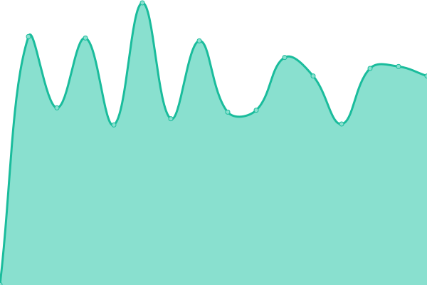 523ms
     
 | 

<a href="https://targed.github.io/uptest/history/gps-telecom">100.00%</a>
    

|  [Gpt.collov](https://gpt.collov.com/.well-known/ai-plugin.json) | 🟩 Up | [gpt-collov.yml](https://github.com/targed/uptest/commits/HEAD/history/gpt-collov.yml) | 

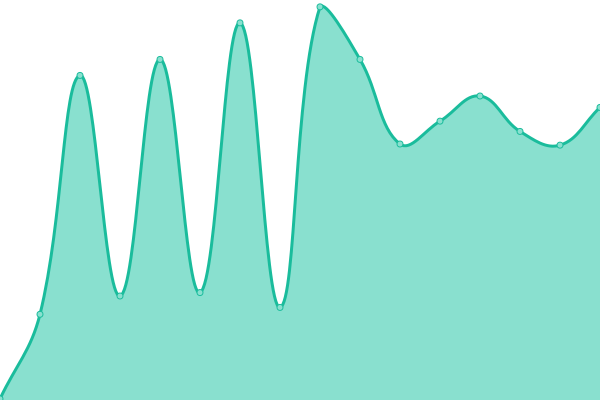 75ms
     
 | 

<a href="https://targed.github.io/uptest/history/gpt-collov">100.00%</a>
    

|  [GPTWeather](https://gptweather.skirano.repl.co/.well-known/ai-plugin.json) | 🟩 Up | [gpt-weather.yml](https://github.com/targed/uptest/commits/HEAD/history/gpt-weather.yml) | 

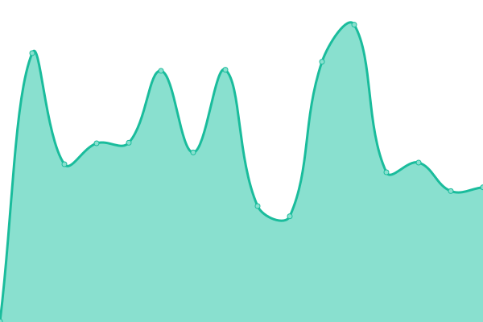 501ms
     
 | 

<a href="https://targed.github.io/uptest/history/gpt-weather">100.00%</a>
    

|  [Greenyroad](https://www.greenyroad.com/.well-known/ai-plugin.json) | 🟩 Up | [greenyroad.yml](https://github.com/targed/uptest/commits/HEAD/history/greenyroad.yml) | 

 84ms
     
 | 

<a href="https://targed.github.io/uptest/history/greenyroad">100.00%</a>
    

|  [Influence Marketing](https://influencermarketing.ai/.well-known/ai-plugin.json) | 🟩 Up | [influence-marketing.yml](https://github.com/targed/uptest/commits/HEAD/history/influence-marketing.yml) | 

 212ms
     
 | 

<a href="https://targed.github.io/uptest/history/influence-marketing">100.00%</a>
    

|  [Infobot](https://infobot.ai/.well-known/ai-plugin.json) | 🟥 Down | [infobot.yml](https://github.com/targed/uptest/commits/HEAD/history/infobot.yml) | 

 146ms
     
 | 

<a href="https://targed.github.io/uptest/history/infobot">0.71%</a>
    

|  [Iowa_State_University_Environmental_Mesonet](https://mesonet.agron.iastate.edu/.well-known/ai-plugin.json) | 🟩 Up | [iowa-state-university-environmental-mesonet.yml](https://github.com/targed/uptest/commits/HEAD/history/iowa-state-university-environmental-mesonet.yml) | 

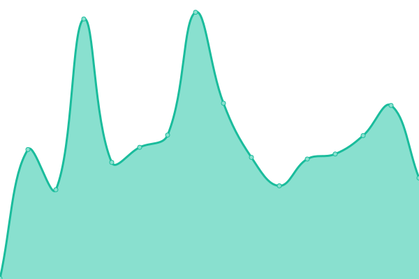 232ms
     
 | 

<a href="https://targed.github.io/uptest/history/iowa-state-university-environmental-mesonet">100.00%</a>
    

|  [Kalendar](https://kalendar.ai/.well-known/ai-plugin.json) | 🟩 Up | [kalendar.yml](https://github.com/targed/uptest/commits/HEAD/history/kalendar.yml) | 

 153ms
     
 | 

<a href="https://targed.github.io/uptest/history/kalendar">100.00%</a>
    

|  [Kittycad](https://api.kittycad.io/.well-known/ai-plugin.json) | 🟩 Up | [kittycad.yml](https://github.com/targed/uptest/commits/HEAD/history/kittycad.yml) | 

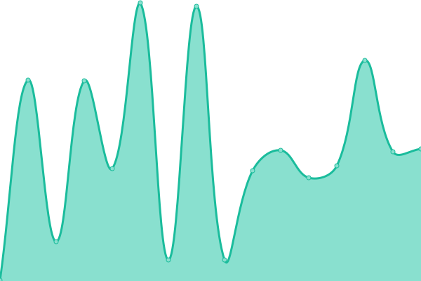 286ms
     
 | 

<a href="https://targed.github.io/uptest/history/kittycad">100.00%</a>
    

|  [Klarna](https://www.klarna.com/.well-known/ai-plugin.json) | 🟩 Up | [klarna.yml](https://github.com/targed/uptest/commits/HEAD/history/klarna.yml) | 

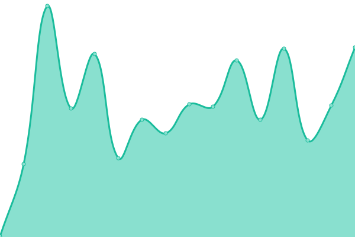 123ms
     
 | 

<a href="https://targed.github.io/uptest/history/klarna">100.00%</a>
    

<!--end: status pages-->

[**Visit our status website →**](https://demo.upptime.js.org)

## 📄 License

- Powered by: [Upptime](https://github.com/upptime/upptime)
- Code: [MIT](./LICENSE) © [targed](https://demo.upptime.js.org)
- Data in the `./history` directory: [Open Database License](https://opendatacommons.org/licenses/odbl/1-0/)
